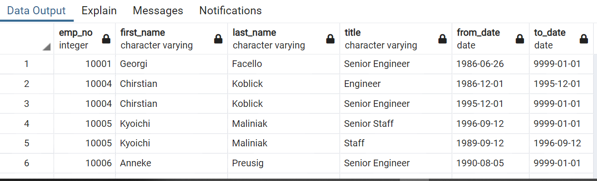

# Pewlett-Hackard-Analysis

## Overview 
Pewlett-Hackard is faced with a large portion of their employees nearing retirement. Management has requested an analysis to identify the employees who are eligible for retirement packages, the number of vacancies P-H will need to fill as a result of the retirements, and employees who are eligible to participate in a mentorship program. 

## Results
4 tables were created to provide insights into the retirement dilemma faced by Pewlett-Hackard. 

     a. RETIREMENT_TITLES: titles of all employees eligible for retire
         - 90,398 employees are eligible for retirement. 
   
     b. UNIQUE_TITLES: identifies the most recent title of employees eligible for retirement 
   
     c. RETIRING_TITLES: count of the number of employees retiring by title 
  
         -Of the employees eligible for retirement 29,414 have the title of Senior Engineers 

     d. MENTORSHIP_ELIGIBITY: employees who are eligible for mentorship program 

        -1549 employees are eligible for the mentorship program 
	
  
  MENTORSHIP PROGRAM
  
  RETIREMENT TITLES
  
   UNIQUE TITLES
## Summary: 
1.How many roles will need to be filled as the "silver tsunami" begins to make an impact? 

There are currently 90,398 employees at Pewlett-Hackard eligible for retirement. 

2.	Are there enough qualified, retirement-ready employees in the departments to mentor the next generation of Pewlett-Hackard employees? 

Yes, there are enough employees. While over 90k employees are eligible for retirement, there are currently only 1,549 employees eligible for the mentorship program. 

Two additional queries that may provide insight are:
1)	Number of employees retiring by department. This will give management a better idea of where the deficits will be 
2)	Retirement Date of employees (MM/YYYY). This will paint a clearer picture of when the employees will be retiring, thus allowing management to plan for staffing needs more efficiently. 

